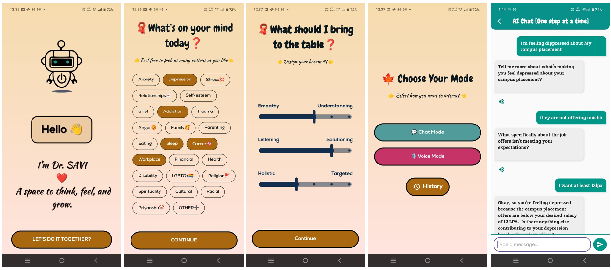
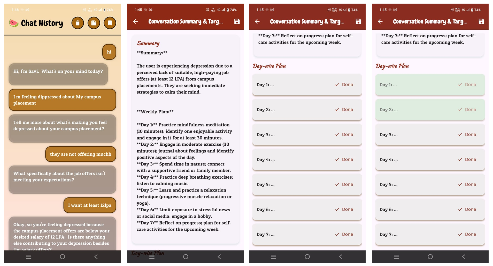
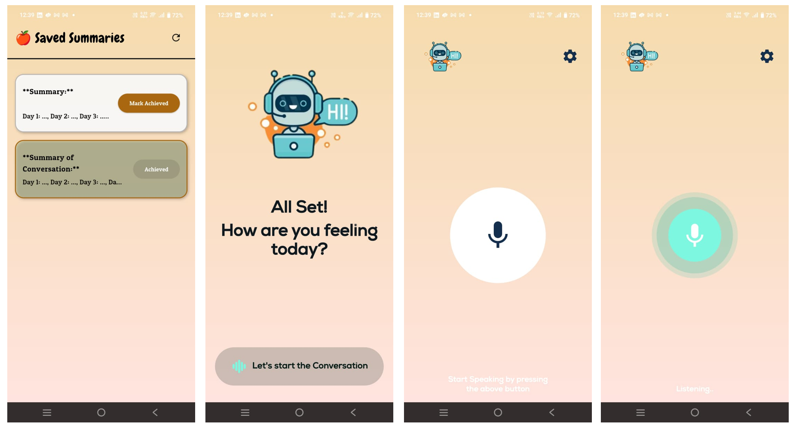

# 🧠 Dr. Savi – AI-Powered Mental Health Companion

Dr. Savi is an AI-powered **personalized mental health support system** built with **Flutter** and powered by the **Gemini API**.  
It provides 24/7 accessible, empathetic, and evidence-based support to help users manage **stress, anxiety, depression, and overall well-being**.

---

## 🌍 Problem Statement
Over **1 billion people** worldwide suffer from mental health issues, yet **75%+ receive no treatment** due to stigma, lack of awareness, and resource shortages.  
Existing solutions often fail to be **personalized, affordable, and culturally inclusive**, leaving millions without support.

---

## 📸 Screenshots

  
  



---

## 🎯 Project Goal
The goal of Dr. Savi is to make mental health care:
- **Accessible** – available anytime, anywhere
- **Affordable** – cost-effective compared to traditional therapy
- **Personalized** – tailored to individual needs and preferences
- **Empathetic** – creating a safe and trusted environment

---

## 🌟 Vision
To create a world where **mental health support is barrier-free**—breaking stigma, cost, and geographic limitations—by empowering individuals with **AI-driven emotional resilience, awareness, and growth tools**.

---

## 🤖 Introducing AI Therapy (Dr. Savi)
Dr. Savi is a **trusted AI mental health companion** that uses:
- **Generative AI (Gemini API)**
- **Evidence-based therapies (CBT & DBT)**
- **Emotion recognition (in progress)**

✨ It adapts to your **personality, preferences, and context**—making therapy engaging, empathetic, and accessible.

---

## 🚀 Features

### 🔹 Onboarding & Personalization
- Customize your AI therapist’s **personality & tone**
- Choose **empathetic** or **solution-focused** approaches
- Blend CBT & DBT dynamically

### 🔹 Voice Conversations
- Engage in **natural, human-like voice interactions**
- Enhance understanding and comfort through tone & empathy

### 🔹 Self-Reflection Over Time
- Weekly/biweekly growth check-ins
- Track personal progress & cognitive patterns
- Encourage **goal-setting & self-compassion**

### 🔹 Custom Support in the Moment
- Real-time meditations & coping strategies
- Tailored assistance for stress, anxiety, or challenges

### 🔹 Emotion Recognition *(Upcoming)*
- Detect emotions via real-time video/image recognition
- Enhance therapy with **multimodal context awareness**

---

## 🛠️ Tech Stack

- **Frontend:** Flutter
- **AI Model:** Gemini API
- **Voice:** Flutter TTS
- **Backend Services:** Firebase (Authentication & Database)
- **Emotion Detection:** Computer Vision (Upcoming)

---

## 🏗️ System Architecture Overview

1. **Speech to Text** → Converts user speech into text
2. **Gemini API** → Generates intelligent, context-aware responses
3. **Text to Speech** → Converts AI responses into natural human-like voice
4. **Personalization Engine** → Customizes therapy sessions
5. **Database (Firebase)** → Stores user preferences securely

---

## 🔐 Key Features of Dr. Savi
- **24/7 Availability** – support whenever needed
- **Evidence-Based** – CBT & DBT integrated
- **Confidential & Secure** – strong privacy measures
- **Scalable** – supports multiple users simultaneously
- **Multilingual Support** (future upgrade)
- **Integration with Wearables** (planned)

---

## 💡 Benefits
- 🌍 Accessibility – available to anyone, anywhere
- 💸 Affordability – cost-effective therapy
- 🤝 Engagement – personalized, empathetic interactions
- 📈 Growth – track progress & self-reflection
- 🌐 Inclusivity – designed for diverse populations

---

## 📲 Installation

1. Clone the repository
   ```bash
   git clone https://github.com/yourusername/dr-savi.git
   cd dr-savi
